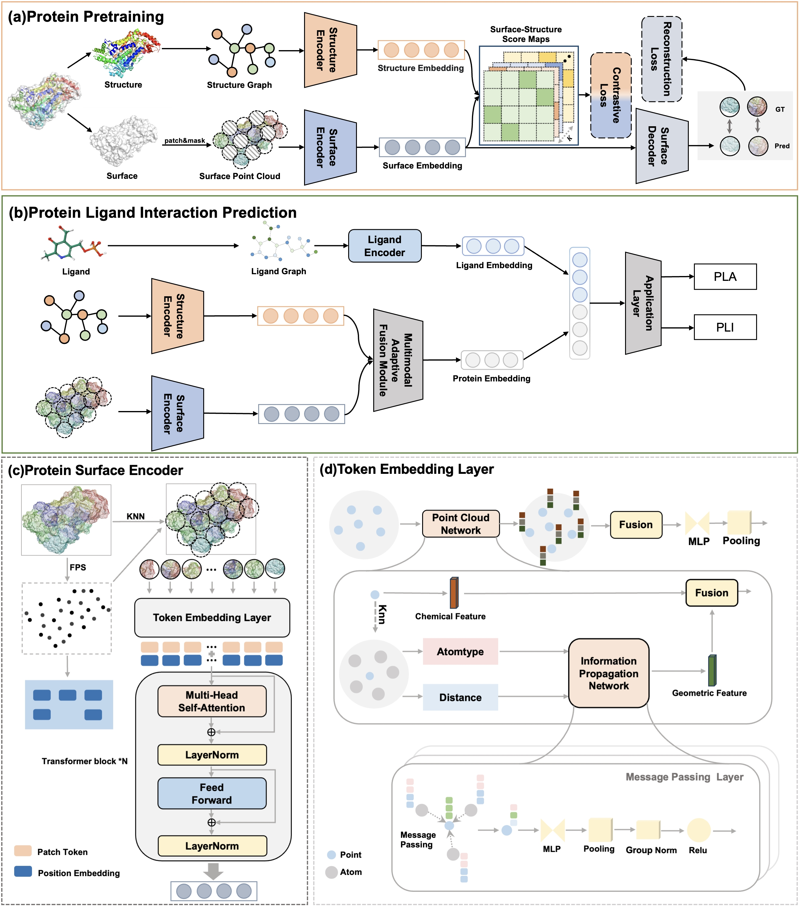

# PLiSAGE: Enhancing Protein-Ligand Interaction Prediction with Multimodal Surface and Geometry Encoding

[](README.md)

## 简介

PLiSAGE 是一个用于蛋白质结构表示学习的深度学习框架。它通过一个新颖的多模态学习策略，同时从蛋白质的原子级结构图（Structure Graph) 和三维表面几何（Surface Geometry）中学习特征，旨在生成更全面、更鲁棒的蛋白质表示，以用于下游生物学任务，如蛋白质-配体相互作用（PLI）和药物-靶点相互作用（DTI）的预测。



## 架构概览

我们的模型主要由两个并行的编码器分支构成，分别处理蛋白质的两种模态信息：

1.  **结构编码器 (Structure Encoder)**: 我们采用几何向量感知机（Geometric Vector Perceptron, GVP）来处理蛋白质的原子级结构图。该模型能够同时学习蛋白质的标量（如氨基酸类型）和矢量（如原子坐标、方向）特征，有效捕捉其共价键结构和空间构象。

2.  **表面编码器 (Surface Encoder)**: 我们设计了一个基于掩码自编码器（Masked Autoencoder, MAE）的PointNet++风格的Transformer模型。该模型首先将蛋白质的三维表面采样为点云，并为每个点计算几何（如曲率）和化学（如附近原子类型）特征。在预训练阶段，通过随机遮盖大部分表面点云，强迫模型从局部可见区域中推理并重建完整的表面，从而学习到强大的表面几何和化学性质表示。

在下游任务中，这两个编码器提取的特征会通过一个Transformer融合模块进行信息交互，最终与配体/药物分子的特征相结合，进行预测。

## 安装与环境设置

我们强烈建议使用 [Conda](https://docs.conda.io/en/latest/) 来管理项目所需的环境。

**1. 克隆本仓库**
```bash
git clone https://github.com/your-username/PLiSAGE.git
cd PLiSAGE
```

**2. 使用 `environment.yaml` 创建并激活Conda环境**

我们提供了完整的环境配置文件，您可以一键创建所需环境。
```bash
# 这将创建一个名为 'plisage' 的新环境
conda env create -f environment.yaml

# 激活新创建的环境
conda activate plisage
```

**3. 编译自定义CUDA扩展**

本项目依赖于一些自定义的CUDA算子，在创建好Conda环境后，需要手动进行编译。请在项目根目录下，依次执行以下命令：

```bash
# 编译 Chamfer Distance
cd extensions/chamfer_dist/
python setup.py install
cd ../../

# 编译 Earth Mover's Distance
cd extensions/emd/
python setup.py install
cd ../../

# 编译 PointNet++ 和 KNN 相关算子 (如果需要)
# 请根据您项目中 pointnet2_ops 和 knn_cuda 的来源和说明进行安装
# 例如: pip install pointnet2_ops_lib/. (假设它们是本地目录)
```

## 数据准备

在进行模型训练前，需要将原始数据预处理成模型可以读取的 `.npz` 格式。

**1. 预训练数据**

*   **数据**: 请将用于预训练的蛋白质PDB文件（或`.pdb.gz`文件）放置在 `data/pre_data/` 目录下（可自行指定）。
*   **运行脚本**: 执行以下命令。请将 `--pdb_directory` 和 `--output_directory` 替换为您的实际路径。
    ```bash
    python predata_process.py --pdb_directory ./data/pre_data --output_directory ./processed_data/processed_pre_data
    ```

**2. PLI 下游任务数据 (PDBbind)**

*   **数据**: 请将 PDBbind 数据集解压，并使其目录结构符合脚本预期（例如，`data/downsteam_data/pdbbind_v2020/1a0q/1a0q_protein.pdb`）。
*   **配置**: 修改 `configs/downsteam_config.yml` 文件中的 `pli_processing` 部分，确保 `raw_data_dir` 和 `index_file_path` 指向您正确的PDBbind路径。
*   **运行脚本**:
    ```bash
    python downstreamtasks/pli/pli_data_process.py --config configs/downsteam_config.yml
    ```

**3. DTI 下游任务数据**

*   **数据**: 准备包含蛋白质ID和药物SMILES字符串的CSV文件，以及对应的PDB文件。
*   **配置**: 修改 `configs/downsteam_config.yml` 文件中的 `dti_processing` 部分，确保路径正确。
*   **运行脚本**:
    ```bash
    python downstreamtasks/dti/dti_data_process.py --config configs/downsteam_config.yml
    ```

## 如何复现

所有训练过程都由配置文件驱动，方便您进行调整和复现。

### 1. 预训练

*   **配置文件**: `configs/pretrain_config.yml`
*   **启动命令**:
    ```bash
    python pre_train.py --config configs/pretrain_config.yml
    ```
*   **关键超参数 (于 `pretrain_config.yml` 中)**:
    *   `seed`: 100
    *   `data.batch_size`: 64
    *   `training.num_epochs`: 100
    *   `optimizer.lr`: 0.0001
    *   `loss.temperature`: 0.05 (对比损失温度系数)
    *   `loss.reconstruction_weight`: 1.0 (重建损失权重)
    *   `loss.contrastive_weight`: 1.0 (对比损失权重)
    *   `model.Point_MAE.transformer_config.mask_ratio`: 0.6 (表面点云掩码率)

### 2. 下游任务微调

#### 蛋白质-配体相互作用 (PLI)

*   **配置文件**: `configs/downsteam_config.yml` ( `pli_training` 节)
*   **启动命令**:
    ```bash
    python downstreamtasks/pli/pli.py --config configs/downsteam_config.yml
    ```
*   **关键超参数 (于 `pli_training` 节中)**:
    *   `seed`: 100
    *   `data.batch_size`: 16
    *   `training.num_epochs`: 100
    *   `training.pretrained_ckpt_path`: './check_point/checkpoint.pth.tar' (预训练模型路径)
    *   `optimizer.lr`: 0.0001
    *   `optimizer.weight_decay`: 0.0005

#### 药物-靶点相互作用 (DTI)

*   **配置文件**: `configs/downsteam_config.yml` ( `dti_training` 节)
*   **启动命令**:
    ```bash
    python downstreamtasks/dti/dti.py --config configs/downsteam_config.yml
    ```
*   **关键超参数 (于 `dti_training` 节中)**:
    *   `seed`: 42
    *   `data.batch_size`: 16
    *   `training.num_epochs`: 100
    *   `training.accumulation_steps`: 8 (梯度累积步数)
    *   `training.pretrained_ckpt_path`: './check_point/checkpoint.pth.tar' (预训练模型路径)
    *   `optimizer.lr`: 0.0001

## 计算资源需求

为了顺利复现本项目，我们建议使用以下或更高配置的计算资源：

*   **GPU**: 本项目的所有实验都在NVIDIA GPU上进行。由于模型尺寸和点云处理的需要，建议使用显存不低于 **16GB** 的GPU（例如 NVIDIA V100, A100, 或 GeForce RTX 3090/4090）。
*   **内存 (RAM)**: 数据预处理过程，特别是处理大型蛋白质时，可能会消耗大量内存。建议配备 **64GB** 或以上的物理内存。
*   **存储 (Storage)**: 原始数据集和处理后的 `.npz` 文件会占用大量磁盘空间。请确保有至少 **100-200GB** 的可用空间，具体取决于您使用的数据集大小。
*   **训练时间**: 在单张NVIDIA A100 GPU上，使用示例数据集的预训练过程大约需要数小时，下游任务微调通常在1-2小时内完成。完整的预训练时间取决于您的数据集规模。

## 引用

如果您在您的研究中使用了PLiSAGE，请引用我们的论文：

```bibtex
@article{Wang2025PLiSAGE,
  author  = {Wang, Tianci and Qiao, Guanyu and Wang, Guohua and Li, Yang},
  title   = {{PLiSAGE}: Enhancing Protein-Ligand Interaction Prediction with Multimodal Surface and Geometry Encoding},
  journal = {Bioinformatics},
  year    = {2025},
  doi     = {10.1093/bioinformatics/btaf608},
  note    = {Manuscript Accepted},
  % --- 下面的信息将在最终排版后提供 ---
  % volume  = {XX},
  % number  = {YY},
  % pages   = {ZZZZ--ZZZZ},
}
```
